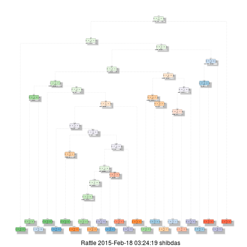

##=================================================================================
## Practical Machine Learning Programming Assignment
##=================================================================================

### Synopsis

In this report, we build a machine learning model, by constructing a classification 
tree from the training dataset and then using the tree to predict the outcome for 
the testing dataset. We also report the estimated out-of-sample error upon doing 
10-fold cross-validation and finally observe that the model is able to classify 
the testing data with a misclassification error that is close to the estimated error.

### Data Processing

First we load the data.


```r
trainURL <- "http://d396qusza40orc.cloudfront.net/predmachlearn/pml-training.csv"
download.file(trainURL,destfile="pml-training.csv")
testURL <- "http://d396qusza40orc.cloudfront.net/predmachlearn/pml-testing.csv"
download.file(testURL,destfile="pml-testing.csv")
training <- read.csv("pml-training.csv",na.strings="")
testing <- read.csv("pml-testing.csv",na.strings="")
```

We examine the outcome variable, which is a factor.


```r
# Outcome variable
levels(training$classe)
```

```
## [1] "A" "B" "C" "D" "E"
```

Thus, the outcome variable has 5 possible values: A, B, C, D, and E.

We further explore the number of observations and complete cases in the 
training dataset.


```r
# Number of observations
nrow(training)
```

```
## [1] 19622
```

```r
# No. of complete cases
sum(complete.cases(training))
```

```
## [1] 406
```

So, clearly there are missing values in the dataset. Missing values are to be imputed for.  
Also, features with zero variance are removed from our list of features.


```r
# Extract the relevant features in numeric formats
train <- training[,-c(1:7,160)]
train1 <- data.matrix(train)
train2 <- data.frame(train1)

# Load the caret package
library(caret)
```

```
## Loading required package: lattice
## Loading required package: ggplot2
## Use suppressPackageStartupMessages to eliminate package startup messages.
```

```r
# Impute the missing values and standardize
set.seed(13343)
preObj <- preProcess(train2,method="knnImpute")
```

```
## Warning in preProcess.default(train2, method = "knnImpute"): These
## variables have zero variances: kurtosis_yaw_belt, skewness_yaw_belt,
## kurtosis_yaw_dumbbell, skewness_yaw_dumbbell, kurtosis_yaw_forearm,
## skewness_yaw_forearm
```

```r
train3 <- predict(preObj,train2)

# Identify and remove the features with zero or near zero variance
nzv <- nearZeroVar(train3,saveMetrics=TRUE)
features <- row.names(nzv[!(nzv$zeroVar),])
train4 <- train3[,features]

# Perform the same preprocessings to the testing dataset
test <- testing[,-c(1:7,160)]
test1 <- data.matrix(test)
test2 <- data.frame(test1)
test3 <- predict(preObj,test2)
test4 <- test3[,features]
```

### Model Building and Estimated Error

We build a decision tree for classification of the training dataset using 
the rpart library in R. Note that this inherently involves a 10-fold 
cross-validation.


```r
# Train the training set to fit a classification tree
library(rpart)
fit <- rpart(training$classe~.,data=train4)
printcp(fit)
```

```
## 
## Classification tree:
## rpart(formula = training$classe ~ ., data = train4)
## 
## Variables actually used in tree construction:
##  [1] accel_dumbbell_y     accel_dumbbell_z     accel_forearm_x     
##  [4] magnet_arm_y         magnet_belt_z        magnet_dumbbell_y   
##  [7] magnet_dumbbell_z    magnet_forearm_z     pitch_belt          
## [10] pitch_forearm        roll_belt            roll_dumbbell       
## [13] roll_forearm         total_accel_dumbbell yaw_belt            
## [16] yaw_forearm         
## 
## Root node error: 14042/19622 = 0.71563
## 
## n= 19622 
## 
##          CP nsplit rel error  xerror      xstd
## 1  0.115155      0   1.00000 1.00000 0.0045002
## 2  0.059987      1   0.88485 0.88485 0.0048075
## 3  0.035679      4   0.70489 0.70524 0.0049876
## 4  0.029839      5   0.66921 0.67106 0.0049839
## 5  0.021934      6   0.63937 0.64115 0.0049709
## 6  0.020083     11   0.51531 0.55925 0.0048875
## 7  0.020011     12   0.49523 0.50242 0.0047870
## 8  0.019228     13   0.47522 0.48804 0.0047557
## 9  0.016807     14   0.45599 0.46268 0.0046947
## 10 0.013460     15   0.43918 0.44880 0.0046579
## 11 0.010789     16   0.42572 0.43178 0.0046095
## 12 0.010255     21   0.36184 0.37901 0.0044351
## 13 0.010113     22   0.35159 0.36298 0.0043744
## 14 0.010000     23   0.34148 0.35130 0.0043276
```

Thus, the estimated 10-fold cross-validated out-of-sample error is given by:


```r
# Root node error * rel error for the deepest level, i.e. 14
OOSError <- 0.71563 * 0.34148
OOSError
```

```
## [1] 0.2443733
```

Thus the estimated error is 24.43%. Let us now plot the model decision tree:


```r
library(rattle)
```

```
## Rattle: A free graphical interface for data mining with R.
## Version 3.4.1 Copyright (c) 2006-2014 Togaware Pty Ltd.
## Type 'rattle()' to shake, rattle, and roll your data.
```

```r
fancyRpartPlot(fit)
```

 

### Prediction of Test Data

Now, we use the model built above to predict the 20 test cases in the test 
dataset.


```r
# Predict the outcomes for the testing set
pred <- predict(fit,test4,type="class")
pred
```

```
##  1  2  3  4  5  6  7  8  9 10 11 12 13 14 15 16 17 18 19 20 
##  B  A  B  D  A  C  D  A  A  A  C  B  C  A  E  E  A  B  B  B 
## Levels: A B C D E
```

These answers were submitted to the course webpage to determine which cases 
were predicted by our model correctly. We use the following code to create 
the appropriate output text files for the submission.


```r
answers <- as.character(pred)
pml_write_files = function(x){
  n = length(x)
  for(i in 1:n){
    filename = paste0("problem_id_",i,".txt")
    write.table(x[i],file=filename,quote=FALSE,row.names=FALSE,col.names=FALSE)
  }
}
pml_write_files(answers)
```

We found that 14 out of 20 test cases were classified correctly. This tallies 
well with our out-of-sample error estimated from our model before.
